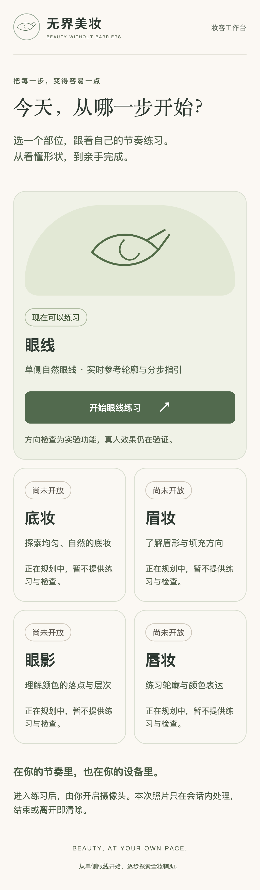
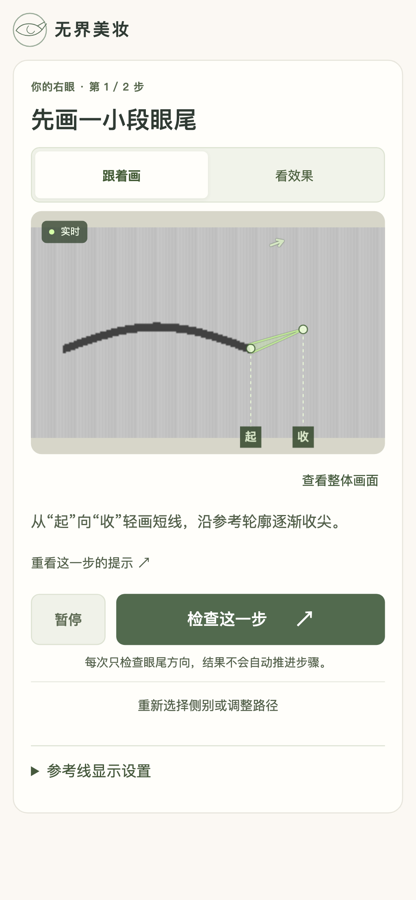
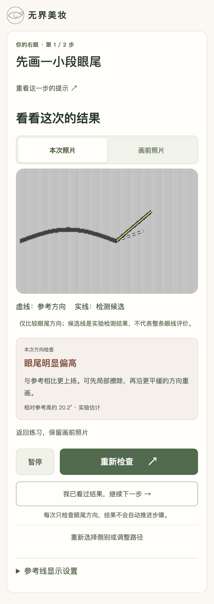
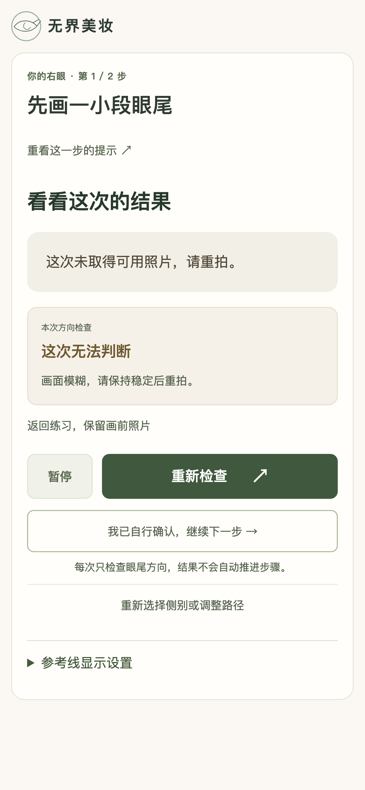
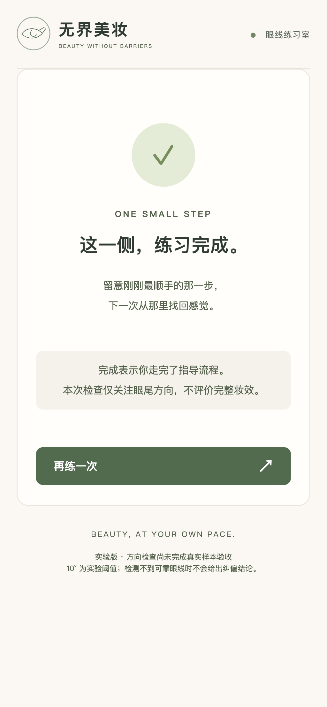

# v0.3 验证与本地验收交接

日期：2026-09-24。开发分支 `codex/v0.3-makeup-workspace`；合并目标 `main`。本次交付为 Draft PR，是否合并由项目发起人本地验收后决定；不删除分支、不修改父 Issue #1。

## 实现范围

对应 #2–#6：工作台与入口/退出、手机专注布局、当前分段指引与显示设置、可取消三秒倒计时及有限候选帧、真实检查照片与有依据的候选线。

- 原始视频、同帧关键点、目标与版本绑定；显示叠加不进入分析输入。
- 候选最多五帧且采集窗口最多一秒；同步模型单次推理时间不能被 JavaScript 强制中断。缺少解码帧计数的浏览器只尝试一帧，不用播放时钟假装获得不同帧。
- 图片只保存在本次会话，取消/暂停使旧请求失效；完成/退出/关闭摄像头释放资源与照片。
- 检测线坐标为当前照片的眼部局部坐标，端点来自候选投影范围，并补偿对齐时的残余平移。未知结果不画检测线；没有新照片时明确要求重拍。
- 仅评价眼尾方向，10° 阈值和原几何没有放宽。未开放模块没有虚构流程或成绩。

## 可复现检查

```sh
npm ci
npm run test
npx playwright install chromium
npm run test:e2e -- --workers=3
npm run build
npm run dev
```

本次最终执行（2026-09-24）：

- `npm run test`：4 个文件、35 项单元/算法测试通过。
- `npm run test:e2e -- --workers=3 --output=/tmp/beauty-v03-final`：30 项通过，约1.2分钟。
- `npm run build`：TypeScript 与 Vite 生产构建通过。
- `git diff --check`：通过。

测试中途曾因审查任务并发使用默认报告目录产生 ENOENT；切换独立输出目录后完整30项重新通过，未把那次运行记作产品通过。

浏览器测试是 Chromium 移动视口与合成视频，不是实体手机。另有真实 MediaPipe 模型/WASM 加载及空画面推理测试；OpenCV 合成样本实际执行算法，没有模拟评价结果。

页面截图由 `tests/visual-states.spec.ts` 生成：390×844、360×800、844×390、1440×900，每种包含工作台、准备、练习、结果、失败、完成和大字状态。原图输出于被忽略的 `test-results/v3-*.png`；下方精选图都是测试合成图，没有真人照片。

已人工检查代表性截图的布局、遮挡、线型和层级；正常手机竖屏测试断言眼部、短提示、主按钮同屏。横屏和文字放大允许滚动。键盘测试包含焦点移动、弹窗取消恢复以及完整两步流程。

## 本地验收顺序

1. 切换到开发分支，安装依赖并启动。打开工作台，确认只有眼线可练习。
2. 开启摄像头，选择自己的左右眼。检查轻微转头、镜像和参考轮廓是否符合实际位置。
3. 拍画前照片，切换高对比/不透明度/整体画面；确认仍停留当前步骤，无需重拍画前照片。
4. 点击检查，试一次取消，再保持正视完成拍摄。查看本次/画前照片和反馈；不要把示意轮廓当成识别结果。
5. 尝试暂停、返回练习、更换目标、退出时取消和确认。完成或退出后核对摄像头指示已关闭。
6. 确认界面可用后，再单独做下述算法/真机验收，最后决定是否合并 PR。

## 尚未执行的真人验收

- 30 对清晰画前/画后样本：10 对调参、20 对独立验收，按参与者隔离；另加10组未画、模糊、遮挡样本。
- 清晰验收至少16对给出判断，其中至少90%与人工标注一致；不可判断样本不输出确定纠偏。
- 主力实体手机连续五轮；三位新手试用并记录卡点。
- 专业美妆规则与真人路径适用性；移动 Safari、性能和长时间运行。

详见 [测试说明](testing.md)。上述项目未通过前，本版本只证明工程主链路和受控合成场景，不宣称可靠真人自动纠偏。

## 界面记录（合成测试画面）

| 工作台 | 专注练习 |
| --- | --- |
|  |  |

| 有依据的结果 | 无可用照片 | 完成 |
| --- | --- | --- |
|  |  |  |
