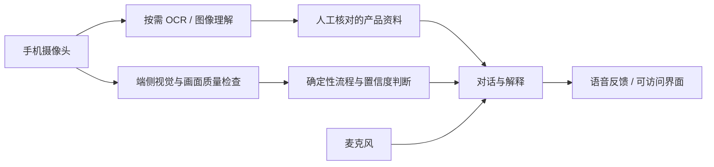

# 欧莱雅第二届美妆科技黑客松：赛道 3 调研与技术判断

核查日期：2026-09-22。以下把官方要求、文档确认的工具能力和方案建议分开；未进行任何模型效果或端到端原型测试。

## 1. 官方赛题比首页更具体

赛事为 2026 年第二届美妆科技黑客松。赛题 3 为“无界体验家——用爱（AI）让美触手可及”。

最重要的入口是 [赛题与数据](https://tianchi.aliyun.com/competition/entrance/532497/information)，而不仅是首页。

官方要求从两个主题中选择：

1. AI 在美妆结合长寿和生命科学领域中的作用。
2. AI 在美妆结合社会和企业责任领域中的作用。

典型场景包括缺少线下专柜、长辈难以理解成分信息、视障人士难以识别色号。官方允许概念方案、设计构想及应用场景设想；可运行、可演示的软件或硬件有利于展示完整性，但不是报名必须具备的形态。

明确技术要求：无。不要求微调 LLM。脑机接口、智能传感器、微型机械控制、触觉反馈、体感摄像头、面部追踪、手势识别和多模态模型都是鼓励探索的方向，不是必须集成的清单。任何方案仍需提供有效的可行性分析和论证。

初赛：精炼 PPT 和讲解或使用演示视频。PPT 覆盖背景与场景洞察、技术方案、核心功能、落地价值及未来规划。

决赛：PPT、现场演讲、使用演示视频；可运行 Demo、源代码及运行指南 zip 更佳。网页、小程序、3D 打印设计等可附链接或视频，官方写明这类其他展示不直接参与打分，会综合评价。

考察维度：创新性、扣题性、精准度与可行性、价值观契合度。当前公开页面没有看到各项分值权重、统一模型准确率门槛或算法榜单评分公式。

## 2. 赛程及资料可获得性

以 [赛事介绍顶部调整公告](https://tianchi.aliyun.com/competition/entrance/532497) 为准：

| 事项 | 当前公告 |
| --- | --- |
| 早鸟提交截止 | 2026-10-07 23:59，北京时间 |
| 常规提交及报名截止 | 2026-10-20 23:59，北京时间 |
| 早鸟晋级名单 | 10 月 23 日 |
| 完整晋级名单 | 11 月 7 日 |
| 训练营 | 11 月 9—23 日 |
| 决赛 | 11 月下旬 |

早鸟锁定 5 支决赛队伍，常规通道 9 支，总计 14 支，属于整个赛事。早鸟未入围自动流转常规评审；10 月 7 日截止后，早鸟提交版本不支持修改或替换。页面下方仍保留旧版初审、训练营和晋级日期，不能将两套时间混用。

总奖金 20 万元属于三个赛题合计，并非赛道 3 独享。面向全日制在校本科、硕士及博士，含 2026 届毕业生；建议 1—5 人组队，每人只能加入一队并选择一个赛题，所有成员都要报名，作品提交后不能修改组队。

详细资料的核查结果：

- 赛题与数据页当前提供的是欧莱雅官网、品牌官方小红书及一篇社会责任微信参考文章，未见统一训练集、测试集、baseline 或技术附件下载。
- [赛道论坛](https://tianchi.aliyun.com/competition/entrance/532497/forum) 在本次未登录公开访问中显示“暂无数据”；这不代表官方群内没有资料。
- 首页有 9 月 17 日主题直播公告和海报，系列内容包括赛题解读、工具应用和优秀 Demo 经验。本次未找到可核验的公开回放或讲义直链；未读取直播本身。
- 首页有钉钉答疑群二维码，并要求参赛者加入，后续通知会在群内同步。
- [社会责任参考文章](https://mp.weixin.qq.com/s/d6rbbXc5sVbAxaBQSmh4ew) 是赛题官方列出的参考入口；内容可获得性另见补充调研，不据此编造要求。

适合向组委会进一步核对：9 月 17 日回放和讲义；各评分维度权重；PPT 页数及视频时长/大小限制；是否会补充产品数据/API；现场演示网络和设备条件。上述事项是本次未查明，而非确定不存在。

## 3. OpenCV 会不会用到

结论：视觉交互方案很可能用到计算机视觉，但不一定必须安装 OpenCV。OpenCV 是图像处理工具库；人脸关键点、手势、文字和物体识别通常还需要相应模型。

| 模块 | 可以承担什么 | 不应直接等同于什么 |
| --- | --- | --- |
| OpenCV / OpenCV.js | 颜色空间转换、图像滤波、区域掩膜、轮廓及几何处理、图像对齐 | 现成且可靠的妆容质量判断系统 |
| MediaPipe Face Landmarker | 人脸关键点、脸部姿态相关信息、面部效果定位 | 口红涂抹范围分割、皮肤健康诊断 |
| MediaPipe Hand Landmarker | 手部关键点与左右手信息 | 口红尖端的位置和接触压力 |
| PaddleOCR 或视觉模型 | 包装文字、标签与说明识读的候选基础能力 | 必然正确的色号、产品匹配或成分解释 |
| 多模态大模型 | 看图问答、语义理解、对话及解释 | 连续帧精确定位和稳定低延迟控制的替代品 |
| ASR / TTS 或实时语音模型 | 听懂需求、播报说明、语音交互 | 完整的无障碍产品体验 |

能力依据：[OpenCV 图像处理](https://docs.opencv.org/4.x/d7/da8/tutorial_table_of_content_imgproc.html)、[MediaPipe Face Web](https://ai.google.dev/edge/mediapipe/solutions/vision/face_landmarker/web_js)、[MediaPipe Hand](https://ai.google.dev/edge/mediapipe/solutions/vision/hand_landmarker)、[PaddleOCR](https://github.com/PaddlePaddle/PaddleOCR)、[百炼视觉理解](https://help.aliyun.com/zh/model-studio/vision)、[Qwen-Omni-Realtime](https://help.aliyun.com/zh/model-studio/realtime)。

MediaPipe 官方 Web 文档提供可运行 JavaScript 示例，输出包括 478 个人脸关键点，以及可选的表情系数和变换矩阵。推理接口会同步阻塞界面线程，连续摄像头场景应考虑 Worker。OpenCV.js 不是使用 MediaPipe 的必需前提；简单叠加可以用 Canvas/WebGL。

## 4. 场景对应的候选技术栈（方案建议，不是官方指定）

| 方向 | 初版组合 | OpenCV 的价值 | 主要难点 |
| --- | --- | --- | --- |
| 长辈语音护肤说明助手 | Web 界面 + Python/FastAPI + OCR/视觉模型 + 产品资料检索 + 语音 | 可选，处理标签图像 | 内容依据、适老交互、避免生成错误产品信息 |
| 视障/低视力美妆辅助 | 手机摄像头 + MediaPipe + OCR + 语音 + 明确流程状态 | 较高，后续做区域/位置和图像质量分析 | 遮挡、识别不确定时如何反馈、真正无需看屏幕 |
| 无专柜人群的虚拟试妆 | React/TypeScript + MediaPipe + Canvas/WebGL + 产品库 | 可选；Python 版原型可用 OpenCV | 光照、肤色、屏幕色差与遮挡，不宜承诺精确还原真实色号 |
| 手部活动受限的辅助化妆设备 | MCU + IMU + 电机/控制程序 + 可选视觉 + 语音 | 取决于是否视觉定位 | 机械结构、稳定控制和实际使用验证；不能用 LLM 直接替代控制回路 |
| 长寿/生命科学研究辅助 | 有出处的知识库 + 文献检索/结构化分析 + 合适数据模型 | 图像研究时才需要 | 数据和专业论证；不能凭普通自拍声称测得生物年龄或功效 |

初版后端可用 Python/FastAPI，方便对接视觉生态；前端可用 React/TypeScript。产品库规模小可以先用 JSON/SQLite，只有资料规模和检索需求增加时再考虑向量数据库。简单流程直接用状态机，不必先引入多 Agent 框架、微调或复杂部署体系。

## 5. 一个可收敛的参赛原型

在尚不知道团队硬件和算法经验的情况下，建议优先验证“社会和企业责任”下的无障碍产品使用辅助。可先聚焦一种人群、一类产品和一段任务，例如：帮助低视力用户确认手里的唇部产品，并在使用前后获得可理解的语音反馈。

分阶段实现：

1. 包装识读 → 从小规模、人工核对的产品库确认产品 → 语音讲解 → 支持重复、暂停和纠错。
2. 增加入镜与光照检查、面部关键点定位和标准化拍摄引导。
3. 有足够样本时再尝试唇部区域颜色/覆盖检查，明确限制在经过验证的产品、光照和姿态范围。

其中第 3 步不是把 MediaPipe 和 OpenCV 拼起来就自然获得的能力：嘴唇边界定位与“涂没涂好”是两个问题。手部关键点也不提供口红尖端，需要额外检测或受控标记。普通 RGB 图像中的像素距离不应未经标定就转成毫米级引导。

建议架构：

实时位置反馈与较慢的语义对话应分开；连续定位在本地运行，大模型按需解释关键帧和产品资料。画面不清或识别置信度不足时先要求重拍，不生成看似精确的判断。

验证应围绕实际任务：产品识别正确率、错误接受率、能否独立完成流程、完成时间、人工介入次数、反馈延迟；覆盖弱光、反光包装、遮挡、偏头和语音噪声。用户验证需要真实目标群体；闭眼模拟只能作为内部可用性检查，不能当成视障用户验证。

## 6. 可以借鉴但需要做出差异的现有产品

- [HAPTA 官方产品页](https://www.loreal.com/en/articles/brands/hapta-lancome/)：针对手臂活动受限人群的辅助唇妆设备，涉及传感器、自调平及电机控制。若选择稳定手部动作的硬件方向，需要解释与它的差异。
- [Beauty Genius 官方介绍材料](https://www.loreal.com/-/media/project/loreal/brand-sites/corp/master/lcorp/press-releases/research-and-innovation/vivatech-2024/press-kitloreal-vivatech2024.pdf?hash=E08F935728DBED317BF78128935AB8B3&rev=54a2c37087bf4cfba8b03d8fa7611e11)：已经包含生成式 AI 美妆问答、个性化产品建议与虚拟试用。通用聊天和试妆本身不足以说明创新，应围绕特定人群未被解决的任务说明价值。
- [Cell BioPrint 官方新闻稿](https://www.loreal.com/en/press-release/research-and-innovation/loreal-cell-bioprint/)：通过取样、蛋白质组学及配套成像等开展皮肤分析。其科研和传感基础不能被普通自拍加一个大模型等价替代。

上述是欧莱雅公开产品资料所述能力，本次未独立测试产品效果。它们不是比赛向选手提供的 SDK、数据集或硬件。更多来源见同目录 `official-supplementary-notes.md`。

## 7. 证据范围

本报告已经浏览器读取天池赛事介绍、赛题与数据及论坛。原始页面文字留存于同目录 `tianchi-introduction.txt`、`tianchi-track3-requirements.txt`。公开资料之外的群公告、直播讲义、登录后提交表单限制尚未核实。

所有建议栈及原型设计均为基于赛题和官方技术文档的工程分析，不代表欧莱雅指定方案或经过比赛验证的获奖路径。
